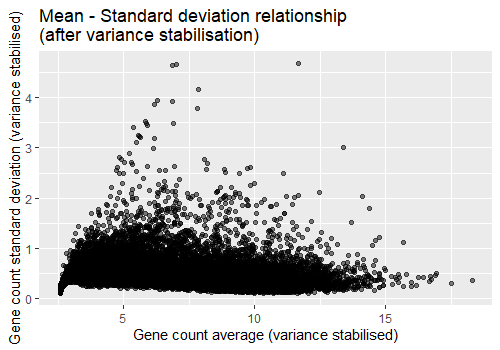
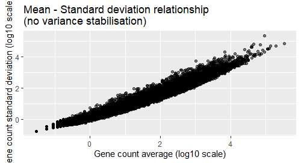
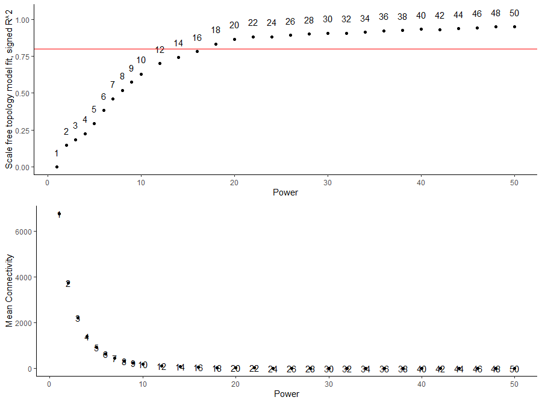
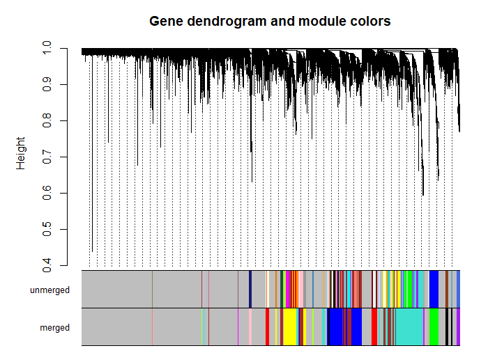
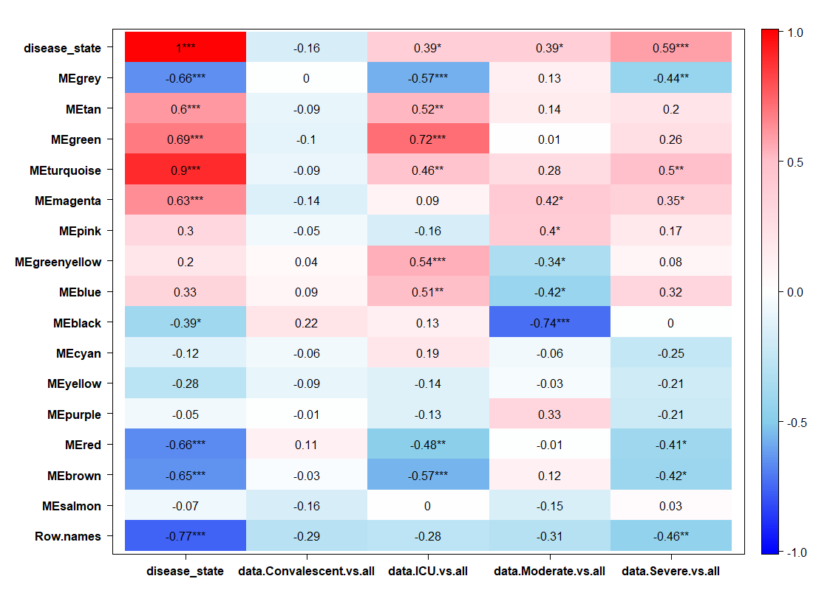

# COVID-19 PBMC RNA-seq WGCNA Project

In this project we aim to study immune response differences between mild and severe COVID-19, identify key immune pathways, and find gene expression signatures.  
**GSE152418** is an RNA-seq dataset of PBMCs from COVID-19 patients and their matched healthy controls.  
The data also include raw gene counts and detailed sample metadata (disease state, severity, etc.) for systems-level immune analysis.  

## Load Data

```r
data <- read.delim('GSE152418_p20047_Study1_RawCounts.txt', header = T)
````

**Example of data:**

| ENSEMBLID       | S145\_nCOV001\_C | S147\_nCoV001EUHM.Draw\.1 | S149\_nCoV002EUHM.Draw\.2 |
| --------------- | ---------------- | ------------------------- | ------------------------- |
| ENSG00000000003 | 16               | 28                        | 9                         |
| ENSG00000000005 | 0                | 1                         | 0                         |

Our data contains different samples and gene counts in each.

---

## Load Metadata

We also need the metadata for our samples so we obtain them using `getGEO` query:

```r
geo_id <- "GSE152418"
gse <- getGEO(geo_id, GSEMatrix = TRUE)
phenoData <- pData(phenoData(gse[[1]]))
```

**Example of titles in phenoData:**
`S145_nCOV001_C`
`S147_nCoV001EUHM_Draw_1`

As we can see, the samples are also present in the second file but there are some differences.
So we need to perform **data manipulation**.

---

## Data Manipulation

* Take all columns except for genes (ENSEMBLID) and store them as `samples`.
* Replace `.` with `_` so that it matches those in our metadata.
* Join them together and create a new dataset with genes as rows and the GEO accession of samples as columns.

```r
data_modified <- data %>% 
  gather(key = 'samples', value = 'counts', -ENSEMBLID) %>% 
  mutate(samples = gsub('\\.', '-', samples)) %>% 
  inner_join(., phenoData, by = c('samples' = 'title')) %>% 
  select(1,3,4) %>% 
  spread(key = 'geo_accession', value = 'counts') %>% 
  column_to_rownames(var = 'ENSEMBLID')
```

---

## Mean-Variance Relationship

One thing that we need to take into consideration is the **variance vs mean relationship** before variance stabilizing transformation.
As we can see, mean is highly related to variance so we need to fix that.

```r
data_modified %>% 
  as.data.frame() %>% 
  rownames_to_column("ENSEMBLID") %>% 
  pivot_longer(cols = -ENSEMBLID, names_to = "sample", values_to = "counts") %>% 
  group_by(ENSEMBLID) %>% 
  summarise(gene_average = mean(counts), gene_stdev = sd(counts)) %>% 
  ungroup() %>% 
  ggplot(aes(x = log10(gene_average), y = log10(gene_stdev))) +
  geom_point(alpha = 0.5, fill = "grey", colour = "black") +
  labs(x = "Gene count average (log10 scale)",
       y = "Gene count standard deviation (log10 scale)") +
  ggtitle("Mean - Standard deviation relationship\n(no variance stabilisation)")
```

---

## Quality Control

Check if there are any missing values:

```r
gsg <- goodSamplesGenes(t(data_modified))
summary(gsg)
gsg$allOK

data_modified <- data_modified[gsg$goodGenes == TRUE,]
```

Clean metadata labels:

```r
names(colData) <- gsub(':ch1', '', names(colData))
names(colData) <- gsub('\\s', '_', names(colData))
```

Check if all metadata samples match and are in the right order:

```r
all(rownames(colData) %in% colnames(data_modified))
all(rownames(colData) == colnames(data_modified))
```

---

## DESeq2 Normalization

At this stage, DESeq2 is just being used as a **normalization engine** and we don't specify any model.

```r
dds <- DESeqDataSetFromMatrix(countData = data_modified.subset,
                              colData = colData,
                              design = ~ 1)
```

Filter genes with enough reads:

```r
dds75 <- dds[rowSums(counts(dds) >= 15) >= 24,]
```

Perform **Variance Stabilizing Transformation (VST):**

```r
vsd = varianceStabilizingTransformation(object = dds75, blind = TRUE, fitType = "parametric")
variance_stabilised_counts <- assay(vsd)
norm.counts <- assay(vsd) %>% t()
```

Plot mean-variance after VST:

```r
variance_stabilised_counts %>% 
  as.data.frame() %>% 
  rownames_to_column("ENSEMBLID") %>% 
  pivot_longer(cols = -ENSEMBLID, names_to = "sample", values_to = "counts") %>% 
  group_by(ENSEMBLID) %>% 
  summarise(gene_average = mean(counts), gene_stdev = sd(counts)) %>% 
  ungroup() %>% 
  ggplot(aes(x = gene_average, y = gene_stdev)) +
  geom_point(alpha = 0.5, fill = "grey", colour = "black") +
  labs(x = "Gene count average (variance stabilised)",
       y = "Gene count standard deviation (variance stabilised)") +
  ggtitle("Mean - Standard deviation relationship\n(after variance stabilisation)")
```

---

## WGCNA Network Construction

Biological systems naturally tend to form **scale-free networks**:

* Most genes have few connections.
* A few genes (hubs) have many connections.
* Hub genes often play essential roles.

Choose soft-thresholding power (β):

```r
power <- c(c(1:10), seq(from = 12, to = 50, by = 2))
sft <- pickSoftThreshold(norm.counts, powerVector = power, networkType = "signed", verbose = 5)
sft.data <- sft$fitIndices
```

Plot SFT.R² and Mean connectivity:

```r
a1 <- ggplot(sft.data, aes(Power, SFT.R.sq, label = Power)) +
  geom_point() + geom_text(nudge_y = 0.1) +
  geom_hline(yintercept = 0.8, color = 'red')

a2 <- ggplot(sft.data, aes(Power, mean.k., label = Power)) +
  geom_point() + geom_text(nudge_y = 0.1)

grid.arrange(a1, a2, nrow = 2)
```


Choose power = **18** (highest connectivity with R² ≥ 0.8):

```r
soft_power <- 18
cor <- WGCNA::cor

bwnet <- blockwiseModules(norm.counts,
                          maxBlockSize = 14000,
                          TOMType = "signed",
                          power = soft_power,
                          mergeCutHeight = 0.25,
                          numericLabels = FALSE,
                          randomSeed = 1234,
                          verbose = 3)
```

---

## Module Eigengenes & Dendrogram

```r
module_eigengenes <- bwnet$MEs
head(module_eigengenes)
table(bwnet$colors)

plotDendroAndColors(bwnet$dendrograms[[1]],
                    cbind(bwnet$unmergedColors, bwnet$colors),
                    c("unmerged", "merged"),
                    dendroLabels = FALSE,
                    hang = 0.03,
                    addGuide = TRUE,
                    guideHang = 0.05,
                    main = "Gene dendrogram and module colors")
```

---

## Module–Trait Correlation

Create trait matrix:

```r
traits <- colData %>%
  mutate(disease_state_bin = ifelse(grepl('COVID', disease_state), 1, 0)) %>%
  select(8)

colData$severity <- factor(colData$severity,
                           levels = c("Healthy", "Convalescent", "ICU", "Moderate", "Severe"))

severity.out <- binarizeCategoricalColumns(colData$severity,
                                           includePairwise = FALSE,
                                           includeLevelVsAll = TRUE,
                                           minCount = 1)

traits <- cbind(traits, severity.out)
```

Compute correlations:

```r
module.trait.corr <- cor(module_eigengenes, traits, use = 'p')
module.trait.corr.pvals <- corPvalueStudent(module.trait.corr, nSamples)

heatmap.data <- merge(module_eigengenes, traits, by = 'row.names') %>%
  column_to_rownames(var = 'Row.names')

CorLevelPlot(heatmap.data,
             x = names(heatmap.data)[17:21],
             y = names(heatmap.data)[1:17],
             col = c("blue1", "skyblue", "white", "pink", "red"))
```

---

## Extract Genes from Top Module

```r
module.gene.mapping <- as.data.frame(bwnet$colors)
module.gene.mapping %>% filter(bwnet$colors == 'turquoise') %>% rownames()
```

Compute **module membership**:

```r
module.membership.measure <- cor(module_eigengenes, norm.counts, use = 'p')
module.membership.measure.pvals <- corPvalueStudent(module.membership.measure, nSamples)
module.membership.measure.pvals[1:10,1:10]
```

Compute **gene significance** for Severe.vs.all:

```r
gene.signf.corr <- cor(norm.counts, traits$data.Severe.vs.all, use = 'p')
gene.signf.corr.pvals <- corPvalueStudent(gene.signf.corr, nSamples)

gene.signf.corr.pvals %>%
  as.data.frame() %>%
  arrange(V1) %>%
  head(25)
```

This identifies the top 25 genes most significantly associated with severe cases.
